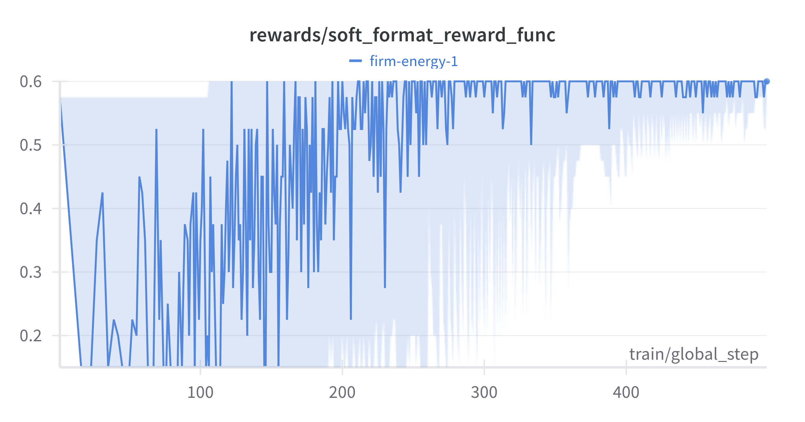
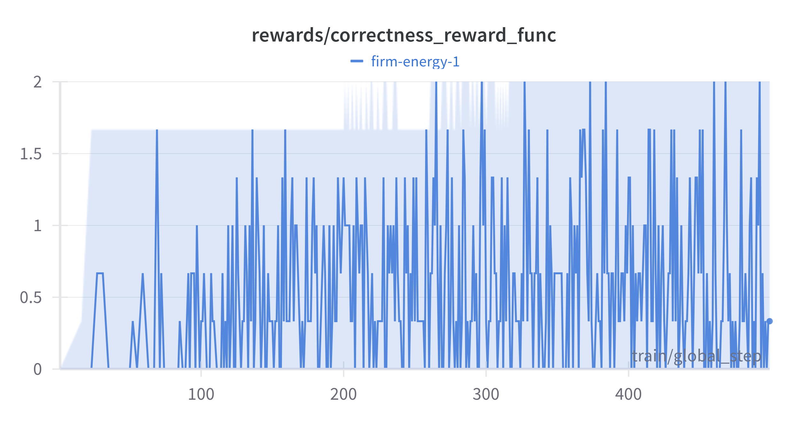
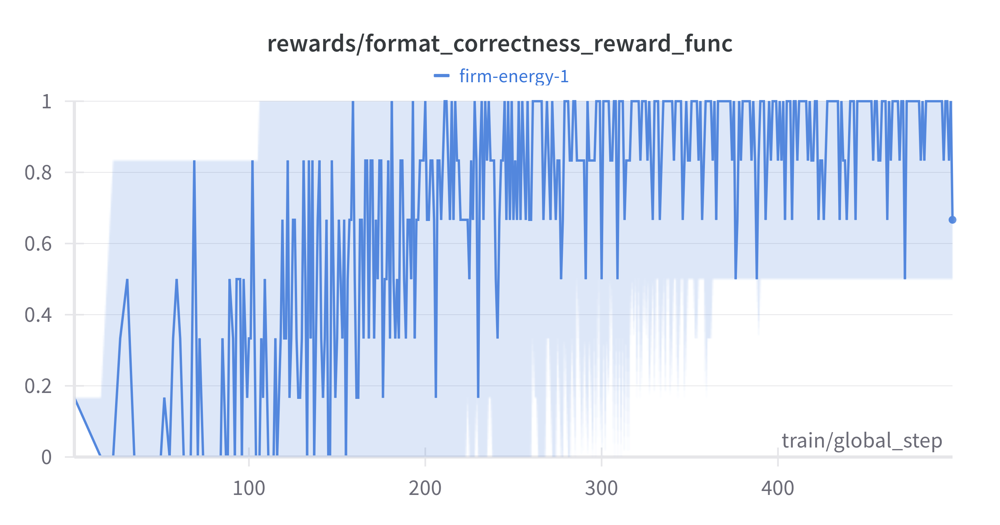
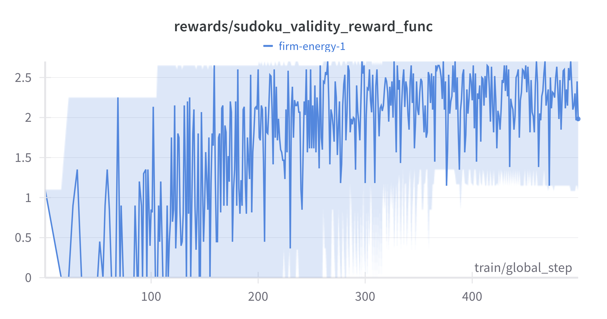
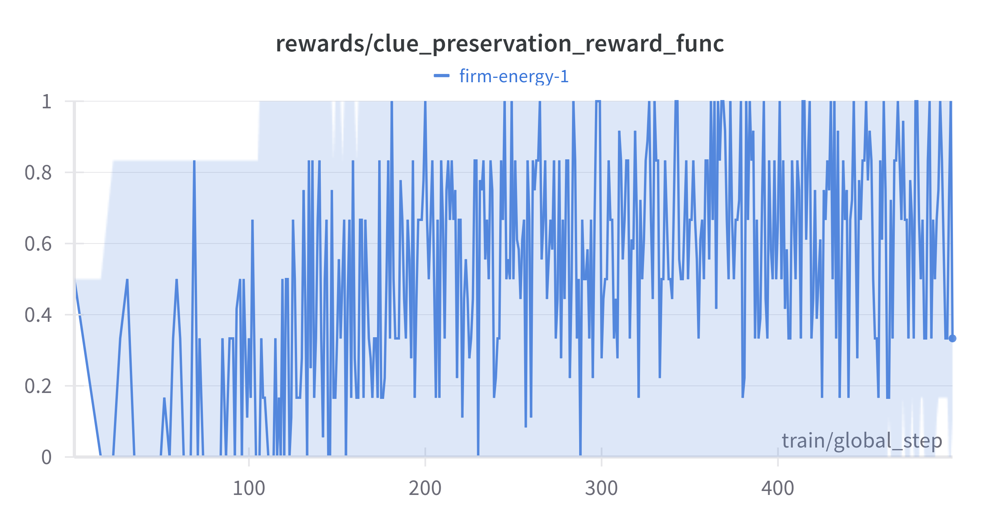

前段时间看到技术博主Hrishbh Dalal通过强化学习让7B模型学习解决数独问题（原文链接：https://hrishbh.com/teaching-language-models-to-solve-sudoku-through-reinforcement-learning/)

由于没有找到源码，我尝试使用Qwen7B模型复刻实验，博客原文中指出模型的尺寸很重要，同时也提出了在训练3B模型时遇到的种种问题——训练不稳定、kl飙升等，不过原文中没有使用冷启动数据集进行sft训练。

因此在我的实验中，在强化学习前置加入了使用冷启动数据集sft微调的步骤，看是否能让3b模型也具有解决数独问题的能力。由于7B模型具有很好的基础能力，进行简单的sft训练后即可输出高质量的推理和较为正确的结果，因此本文重点介绍3B模型的训练。

本项目中包含了数据准备、模型训练、和评估的完整过程！文件结构：
- data_download.py。用来下载kaggle 4M数独数据集；
- create_sudoku_dataset.py。使用DeepSeek API构造50条高质量推理数据作为冷启动数据集；
- sudoku_train.ipynb。完整的训练和测试代码。


## 实验背景

数独作为一种需要严格逻辑推理的游戏，对语言模型来说是一个挑战，大型推理模型（DeepSeek-R1，4o-mini）在该上任务的表现不错。
但是较小的语言模型通常在解决需要精确计算和逐步推理的任务（如数学问题或游戏解谜）时表现不佳。所以本文想看一下能否通过强化学习训练，让3B模型在数独问题上进行有效的推理，并生成正确答案。同时也能说明小模型在通过强化学习后，可以具备解决特定任务的能力。

正好DeepSeek-R1使用的grpo策略较大地降低了训练复杂度和资源成本（无需训练Critical模型），同时Unsloth框架也提供了较好的单机LoRA训练性能，因此我们可以在本地显卡上进行sft微调和grpo训练，实测3B的Qwen模型训练阶段的显存占用在15GB左右，7B模型则在19GB左右（具体取决于LoRA、max_tokens等参数设置），基本上一张2080ti22GB或3090就能完成训练！

本实验使用的数据集来自kaggle的400万数独数据集（但是仅使用了其中50条数据构造冷启动数据，数据集链接：https://www.kaggle.com/datasets/informoney/4-million-sudoku-puzzles-easytohard

训练时：
- 使用Qwen2.5-3B-Instruct作为基础模型
- 使用DeepSeek API构造50条高质量推理数据作为冷启动数据集
- 使用Unsloth框架进行LoRA微调（包括冷启动数据的sft以及grpo训练）
- 使用Weights & Biases进行实验追踪与可视化
- 使用ubuntu环境（使用WSL进行unsloth的微调可能遇到各种各样奇怪的问题导致训练失败，因此强烈不建议使用WSL！！！）

## 数据准备

数据方面使用到了前文提到的kaggle数据集，其中使用了50条数据构造冷启动数据集（冷启动数据收集理解为，在进行高强度的强化学习训练之前，使用sft让模型具备良好的推理基础。目标是让模型学习何为高质量的推理，以及如何清晰地呈现推理过程），冷启动数据处理如下 ：

1. **筛选适当难度的数独**：由于更难的数独往往需要更长的推理过程，而上下文token数量有限，因此筛选了线索数量为78-80的数独题目（线索数是指初始数独中已填入的数字数量）。
2. **格式化数据**：将原始的一维数独字符串转换为更直观的9x9矩阵格式。
3. **生成高质量答案**：使用DeepSeek Reasoner生成带有详细推理过程的解答。
4. **构建训练数据**：将数据整合为包含问题、推理过程和答案的结构化格式。

数据准备的核心代码在`create_sudoku_dataset.py`文件中，该脚本调用DeepSeek API获取高质量的推理过程，并将结果保存为JSON格式的数据集：

```python
def create_dataset(input_file, output_file, num_samples=200, min_clues=78):
    """创建数独推理数据集"""
    # 解析数据集
    data = parse_sudoku_data(input_file, num_samples, min_clues)
    
    # 创建结果列表
    results = []
    
    # 处理每个数独谜题
    for idx, item in enumerate(data):
        print(f"处理第 {idx+1}/{len(data)} 个数独，线索数: {item['clue_numbers']}...")
        
        puzzle = item['quizzes']
        solution = item['solutions']
        clue_number = item['clue_numbers']
        
        # 格式化数独谜题
        formatted_puzzle = format_sudoku(puzzle)
        if not formatted_puzzle:
            print(f"跳过索引 {idx}，无法格式化谜题")
            continue
        
        # 调用DeepSeek API
        reasoning, answer = call_deepseek_api(formatted_puzzle)
        
        if reasoning and answer:
            # 创建数据条目
            entry = {
                "question": f"""以下是一个数独游戏，在9乘9的81宫格中，数字的顺序分别为：
{formatted_puzzle}
其中0代表空缺的数字，需要你去填写，请你完成这个数独游戏，并输出相同格式的答案。""",
                "answer": f"<think>{reasoning}</think>\n\n<answer>{answer}</answer>",
                "original_puzzle": puzzle,
                "original_solution": solution,
                "clue_number": clue_number
            }
            
            results.append(entry)
```

这里使用了标签`<think>...</think>`和`<answer>...</answer>`分别包裹推理过程和最终答案。

## 监督微调（SFT）

在应用grpo强化学习前，首先对Qwen2.5-3B-Instruct模型进行监督微调（SFT）,这一步使用到了上一步构造的冷启动数据，主要目的是让模型初步学习推理格式。

微调使用了Unsloth框架，配置如下：

```python
def load_model(model_name="Qwen/Qwen2.5-3B-Instruct"):
    """加载基础模型并配置LoRA"""
    model, tokenizer = FastLanguageModel.from_pretrained(
    model_name = "Qwen/Qwen2.5-3B-Instruct",
    max_seq_length = max_seq_length,
    load_in_4bit = True, # False for LoRA 16bit
    fast_inference = True, # Enable vLLM fast inference
    max_lora_rank = lora_rank,
    gpu_memory_utilization = 0.6, # Reduce if out of memory
    )

    model = FastLanguageModel.get_peft_model(
        model,
        r = lora_rank, # Choose any number > 0 ! Suggested 8, 16, 32, 64, 128
        target_modules = [
            "q_proj", "k_proj", "v_proj", "o_proj",
            "gate_proj", "up_proj", "down_proj",
        ], # Remove QKVO if out of memory
        lora_alpha = lora_rank,
        use_gradient_checkpointing = "unsloth", # Enable long context finetuning
        random_state = 3407,
    )
    
    return model, tokenizer
```

这里使用了LoRA（Low-Rank Adaptation）技术来高效微调模型。关键参数设置：
- LoRA rank：16（较大的rank值提供更好的学习能力，但训练更慢）
- 最大序列长度：3000（足够容纳数独问题和详细的推理过程）
- 量化精度：4-bit（降低显存占用）

微调训练配置：
```python
def setup_trainer(model, tokenizer, train_dataset):
    """设置训练器"""
    trainer = SFTTrainer(
        model = model,
        tokenizer = tokenizer,
        train_dataset = train_dataset,
        dataset_text_field = "text",
        max_seq_length = max_seq_length,
        dataset_num_proc = 2,
        packing = False, # Can make training 5x faster for short sequences.
        args = TrainingArguments(
            per_device_train_batch_size = 2,
            gradient_accumulation_steps = 4,
            warmup_steps = 5,
            max_steps = 60,
            learning_rate = 2e-4,
            fp16 = not is_bfloat16_supported(),
            bf16 = is_bfloat16_supported(),
            logging_steps = 1,
            optim = "adamw_8bit",
            weight_decay = 0.01,
            lr_scheduler_type = "linear",
            seed = 3407,
            output_dir = "outputs",
            report_to = "none",
        ),
    )
    
    return trainer
```

监督微调对于后续的强化学习非常重要，它为模型提供了基础技能，相较于直接上高强度的强化学习训练（Deepseek-R1 Zero的训练方式），使用冷启动数据进行初步微调，可以使模型更快地理解数独问题并输规定格式的答案。

我们对比一下sft前后，模型在解决相同数独问题上的输出：

问题：
```text
以下是一个数独游戏，在9乘9的81宫格中，数字的顺序分别为：
6 5 7 | 2 3 9 | 0 4 1
9 3 2 | 8 1 4 | 7 0 5
4 1 8 | 7 5 6 | 2 0 3
------+-------+------
1 2 4 | 6 8 5 | 9 3 7
3 7 9 | 4 2 1 | 6 5 8
5 8 6 | 9 7 3 | 4 1 2
------+-------+------
8 4 5 | 3 6 7 | 1 2 9
7 6 3 | 1 9 2 | 5 8 4
2 9 1 | 5 4 8 | 3 7 6
其中0代表空缺的数字，需要你去填写，请你完成这个数独游戏，并输出相同格式的答案。
```
不同阶段的模型使用统一的system prompt：
```python
# 添加系统提示
SYSTEM_PROMPT = """
用以下格式回答问题:
<think>推理过程</think>
<answer>答案</answer>
"""
```

3B instruct模型输出：
```text
<think>观察每一行、每一列、每一个3x3的小宫格，确定每个空缺位置的数字。</think>
<answer>
6 5 7 | 2 3 9 | 1 4 8
9 3 2 | 8 1 4 | 7 5 0
4 1 8 | 7 5 6 | 2 0 3
+-------+-------+------
1 2 4 | 6 8 5 | 9 3 7
3 7 9 | 4 2 1 | 6 5 8
5 8 6 | 9 7 3 | 4 1 2
+-------+-------+------
8 4 5 | 3 6 7 | 1 2 9
7 6 3 | 1 9 2 | 5 8 4
2 9 1 | 5 4 8 | 3 7 6
</answer>
```
这里3B instruct给出了简短且无效的“推理”过程和错误的答案，不过还是遵循了系统提示词要求的答案格式（包含think和answer标签），但在数独的输出格式上，分割线具有明显的错误。

3B sft模型输出：
```text
<think>嗯，我现在得解决这个数独题目。首先，我得仔细看看题目给出的数独布局。题目中的数独已经填了一些数字，但有一个0，也就是空缺的位置需要填补。我的任务就是找出每个0的位置应该填什么数字，使得每一行、每一列以及每个3x3的小九宫格都包含1-9不重复的数字。

首先，我需要把题目中的数独结构理清楚。题目给出的数独分为9个3x3的小宫格。比如，第一行的前三个数字是6、5、7，接下来的三个是2、3、9，然后是0、4、1。所以这个行里已经有6、5、7、2、3、9、4、1，缺少的数字应该是8。所以可能这个0的位置应该填8？但需要进一步确认是否符合列和小宫格的条件。

接下来，我需要检查该行是否有8。第一行的数字是6、5、7、2、3、9、4、1、0。哦，是的，第一行已经有的数字是6、5、7、2、3、9、4、1，所以缺少的是8。那这个0的位置应该填8？但需要看所在的列和小宫格是否有冲突。

现在，这个0位于第一行的第三个位置，也就是第一行第三列。那我需要检查这一列（第三列）和第三个小宫格是否有8。

首先看第三列。第三列的数字是：第一行的第三列是7，第二行是2，第三行是8，第四行是4，第五行是9，第六行是6，第七行是5，第八行是3，第九行是1。所以第三列已有的数字是7、2、8、4、9、6、5、3、1。缺少的数字是1、3、5、6、9。所以第三列缺少的数字是1、3、5、6、9。那第一行第三列的0，如果填8的话，是否在第三列中已经存在？第三列已经有的数字是7、2、8、4、9、6、5、3、1，所以填8的话，第三列没有8，所以没问题。那这个位置应该填8。

接下来检查第三小宫格。第三个小宫格是第一到第三行，第一到第三列。这个宫格中的数字是：第一行前三列是6、5、7；第二行前三列是9、3、2；第三行前三列是4、1、8。所以这个宫格中的数字是6、5、7、9、3、2、4、1、8。这些数字都是唯一的，没有重复。所以填8不会冲突。

所以，这个0的位置应该填8。那第一行第三列的0就变成了8。那整个数独中的第一个0就被填补了。

现在，整个数独是否已经完成？或者还有其他0需要填吗？

接下来，我需要检查其他行是否有0。比如，第二行是9、3、2、8、1、4、7、0、5。这里第二个数字是3，第三个是2，其他都填满了。所以第二行可能没有0。第三行是4、1、8、7、5、6、2、0、3。这里第三个是8，所以可能填8？但第三行的第三个数字是8，所以可能填的是其他数字？或者第三行是否有其他0？

第四行是1、2、4、6、8、5、9、3、7。填满了。

第五行是3、7、9、4、2、1、6、5、8。填满了。

第六行是5、8、6、9、7、3、4、2、1。填满了。

第七行是8、4、5、3、6、7、1、2、9。填满了。

第八行是7、6、3、1、9、2、5、8、4。填满了。

第九行是2、9、1、5、4、8、3、7、6。填满了。

所以，整个数独中只有第一行第三列的0需要填。填完之后，整个数独就完成了。

那现在，我需要检查整个数独是否正确。比如，每一行、每一列、每个小宫格是否都包含1-9不重复的数字。

例如，第一行填完后是6、5、8、2、3、9、4、1、7。检查是否有重复：6、5、8、2、3、9、4、1、7，没有重复，正确。

第三行填完后是4、1、8、7、5、6、2、9、3。检查是否有重复：4、1、8、7、5、6、2、9、3，没有重复，正确。

第三列填完后是7、2、8、4、9、6、5、3、1。没有重复，正确。

第三宫格填完后是6、5、8，9、3、2，4、7、5、6。这些数字都是唯一的，正确。

其他行、列、宫格都检查一遍，应该没问题。所以最终的答案就是将第一行第三列的0替换为8，其他位置不变。</think>

<answer>6 5 8 | 2 3 9 | 0 4 1
9 3 2 | 8 1 4 | 7 0 5
4 1 8 | 7 5 6 | 2 0 3
------+-------+------
1 2 4 | 6 8 5 | 9 3 7
3 7 9 | 4 2 1 | 6 5 8
5 8 6 | 9 7 3 | 4 1 2
------+-------+------
8 4 5 | 3 6 7 | 1 2 9
7 6 3 | 1 9 2 | 5 8 4
2 9 1 | 5 4 8 | 3 7 6</answer>
```
这里3B sft给出了推理过程和错误的答案，也遵循了系统提示词，给出了要求的答案格式（包含有think和answer标签），answer标签中数独的格式是正确的。我们重点看推理部分：

*<span style="color:green">"嗯，我现在得解决这个数独题目。首先，我得仔细看看题目给出的数独布局。题目中的数独已经填了一些数字，但有一个0，也就是空缺的位置需要填补。我的任务就是找出每个0的位置应该填什么数字，使得每一行、每一列以及每个3x3的小九宫格都包含1-9不重复的数字。*

*<span style="color:green">首先，我需要把题目中的数独结构理清楚。题目给出的数独分为9个3x3的小宫格。比如，第一行的前三个数字是6、5、7，接下来的三个是2、3、9，然后是0、4、1。所以这个行里已经有6、5、7、2、3、9、4、1，缺少的数字应该是8。所以可能这个0的位置应该填8？但需要进一步确认是否符合列和小宫格的条件。*

*<span style="color:green">接下来，我需要检查该行是否有8。第一行的数字是6、5、7、2、3、9、4、1、0。哦，是的，第一行已经有的数字是6、5、7、2、3、9、4、1，所以缺少的是8。那这个0的位置应该填8？但需要看所在的列和小宫格是否有冲突。*

*<span style="color:red">现在，这个0位于第一行的第三个位置，也就是第一行第三列。那我需要检查这一列（第三列）和第三个小宫格是否有8。"*

可以看出在前序推理过程中，模型给出了正确的推理（绿色文本），但在数第一行空白位置的列数时，发生了错误（红色文本）。而在第二行、第三行是否有空白的判断时，也出现了错误：

*<span style="color:red">“接下来，我需要检查其他行是否有0。比如，第二行是9、3、2、8、1、4、7、0、5。这里第二个数字是3，第三个是2，其他都填满了。所以第二行可能没有0。第三行是4、1、8、7、5、6、2、0、3。这里第三个是8，所以可能填8？但第三行的第三个数字是8，所以可能填的是其他数字？或者第三行是否有其他0？......”*

不过这里使用冷启动数据集做sft训练的主要作用是引导模型输出推理和尽量符合格式的答案，使我们的模型在强化学习的探索阶段不至于过于艰难，从当前结果来看，sft阶段还是较好的完成了既定任务。

## GRPO强化学习

在进行监督微调后，继续使用了GRPO方法进行进一步训练。

### 奖励函数设计

奖励函数的设计是GRPO训练的核心。这里设计了五个奖励函数，每个关注不同的方面：
- **软格式奖励函数（soft_format_reward_func）**。检查生成文本是否包含必要的XML标签（think&answer），鼓励模型保持指定的输出格式。当生成文本中含有\<think\>、\</think\>、\<answer\>、\</answer\>中任意一个时，可以累计获得0.15分奖励，最高0.6分；
- **正确性奖励函数（correctness_reward_func）**。从模型生成的答案中提取answer tag中的内容，并与正确答案作比较。答对获得2分，答错不得分；
- **格式正确性奖励函数（format_correctness_reward_func）**。这里提到的格式与软格式奖励中要求的标签格式不同，指的是要求模型输出的数独格式符合数独表示规范，包括正确的分隔符和行列结构。格式正确加1分，错误不得分；
- **数独有效性奖励函数（sudoku_validity_reward_func）**。要求模型一步生成正确的数独结果过于困难，因此我们可以针对数独结果给予部分奖励，即验证数独解答是否符合基本规则：每行、每列、每个3x3小框都包含1-9的数字不重复。行、列、小框符合规则时，可以累加0.1分；
- **线索保留奖励函数（clue_preservation_reward_func）**。我们发现，未经强化学习的模型在解决数独问题时，可能会改变数独中已有线索的值，这会导致数独问题还没有解决却引入了更多的错误，因此我们设计奖励函数，确保模型在解答时保留了原始数独中已有的数字，只填充空白格子（为0的区域），具体规则是如果给出的答案中，原有线索发生了改变，则得0分，如果原有线索未发生改变，则根据填写的数字正确性给予成比例的奖励，累计最高可得1分。

下面是各个奖励函数的实现：

1. **软格式奖励函数（soft_format_reward_func）**
   ```python
   def soft_format_reward_func(completions, **kwargs) -> list[float]:
       """检查生成的内容是否具有特定格式"""
       pattern = r"<think>.*?</think>\s*<answer>.*?</answer>"
       responses = [completion[0]["content"] for completion in completions]
       
       rewards = []
       
       for response in responses:
           contains_think_open = "<think>" in response
           contains_think_close = "</think>" in response
           contains_answer_open = "<answer>" in response
           contains_answer_close = "</answer>" in response
           
           # match = re.match(pattern, response, re.DOTALL)
           match = false
           
           # 计算奖励
           if match:
               reward = 1.0  # 完全匹配正则，直接给满分
           else:
               reward = (
                   (0.15 if contains_think_open else 0) +
                   (0.15 if contains_think_close else 0) +
                   (0.15 if contains_answer_open else 0) +
                   (0.15 if contains_answer_close else 0)
               )
           
           rewards.append(reward)
       
       return rewards
   ```

2. **正确性奖励函数（correctness_reward_func）**

   ```python
   def correctness_reward_func(prompts, completions, answer, **kwargs) -> list[float]:
       responses = [completion[0]['content'] for completion in completions]
       
       # 提取答案，如果提取失败则返回空字符串
       extracted_responses = [extract_xml_answer(r) for r in responses]
       
       # 比较答案，空字符串直接返回0分
       return [2.0 if r and r == a else 0.0 for r, a in zip(extracted_responses, answer)]
   ```

3. **格式正确性奖励函数（format_correctness_reward_func）**

   ```python
   def format_correctness_reward_func(completions, **kwargs) -> list[float]:
       """检查答案是否符合正确的格式"""
       responses = [completion[0]["content"] for completion in completions]
       rewards = []
       
       for response in responses:
           # 提取<answer>标签中的内容
           answer = extract_xml_answer(response)
           
           # 如果提取失败，直接返回0分
           if not answer:
               rewards.append(0.0)
               continue
           
           # 检查格式是否正确
           lines = answer.strip().split('\n')
           
           if len(lines) != 11:  # 9行数字 + 2行分隔线
               rewards.append(0.0)
               continue
               
           # 检查每行的格式
           format_correct = True
           for i, line in enumerate(lines):
               if i in [3, 7]:  # 分隔线
                   if line != "------+-------+------":
                       format_correct = False
                       break
               else:  # 数字行
                   parts = line.split('|')
                   if len(parts) != 3:
                       format_correct = False
                       break
                   for part in parts:
                       if len(part.strip().split()) != 3:
                           format_correct = False
                           break
           
           rewards.append(1.0 if format_correct else 0.0)
       
       return rewards
   ```

4. **数独有效性奖励函数（sudoku_validity_reward_func）**

   ```python
   def sudoku_validity_reward_func(completions, **kwargs) -> list[float]:
       """检查答案是否是有效的数独解"""
       responses = [completion[0]["content"] for completion in completions]
       rewards = []
       
       for response in enumerate(responses):
           # 提取<answer>标签中的内容
           answer = extract_xml_answer(response)
           
           # 如果提取失败，直接返回0分
           if not answer:
               rewards.append(0.0)
               continue
           
           try:
               # 将答案转换为9x9矩阵
               lines = answer.strip().split('\n')
               grid = []
               for line in lines:
                   if line == "------+-------+------":
                       continue
                   # 移除分隔符并分割数字
                   numbers = line.replace('|', '').split()
                   grid.append([int(n) for n in numbers])
               
               # 检查每行、每列、每个3x3小框
               row_rewards = 0
               col_rewards = 0
               box_rewards = 0
               
               # 计算行奖励
               for row in grid:
                   if set(row) == set(range(1, 10)):
                       row_rewards += 0.1
               
               # 计算列奖励
               for col in range(9):
                   column = [grid[row][col] for row in range(9)]
                   if set(column) == set(range(1, 10)):
                       col_rewards += 0.1
               
               # 计算3x3小框奖励
               for box_row in range(0, 9, 3):
                   for box_col in range(0, 9, 3):
                       box = []
                       for i in range(3):
                           for j in range(3):
                               box.append(grid[box_row + i][box_col + j])
                       if set(box) == set(range(1, 10)):
                           box_rewards += 0.1
               
               # 总奖励为各部分之和
               total_reward = row_rewards + col_rewards + box_rewards
               rewards.append(total_reward)
               
           except Exception as e:
               rewards.append(0.0)
       
       return rewards
   ```

5. **线索保留奖励函数（clue_preservation_reward_func）**
   
   确保模型在解答时保留了原始数独中已有的数字，只填充空白格子。

   ```python
   def clue_preservation_reward_func(prompts, completions, **kwargs) -> list[float]:
       """检查是否保留了原始线索并正确填充空白单元格"""
       responses = [completion[0]["content"] for completion in completions]
       questions = [prompt[-1]["content"] for prompt in prompts]
       rewards = []
       
       for response, question in zip(responses, questions):
           # 提取答案
           answer = extract_xml_answer(response)
           if not answer:
               rewards.append(0.0)
               continue
               
           try:
               # 从问题中提取原始数独
               original_grid = []
               for line in question.split('\n'):
                   if '|' in line and not line.startswith('------'):
                       # 移除分隔符并分割数字
                       numbers = line.replace('|', '').split()
                       original_grid.append([int(n) if n != '0' else 0 for n in numbers])
               
               # 从答案中提取填充后的数独
               filled_grid = []
               for line in answer.split('\n'):
                   if '|' in line and not line.startswith('------'):
                       # 移除分隔符并分割数字
                       numbers = line.replace('|', '').split()
                       filled_grid.append([int(n) for n in numbers])
               
               # 检查原始线索是否保持不变
               clue_preserved = True
               empty_cells = 0
               correct_fills = 0
               
               for i in range(9):
                   for j in range(9):
                       if original_grid[i][j] != 0:  # 这是一个原始线索
                           if original_grid[i][j] != filled_grid[i][j]:
                               clue_preserved = False
                               break
                       else:  # 这是一个空单元格
                           empty_cells += 1
                           if filled_grid[i][j] in range(1, 10):  # 确保填充的是有效数字
                               correct_fills += 1
               
               if not clue_preserved:
                   rewards.append(0.0)
                   continue
               
               # 计算奖励
               if empty_cells > 0:
                   reward = correct_fills / empty_cells
               else:
                   reward = 1.0  # 如果没有空单元格，说明所有线索都正确
               
               rewards.append(reward)
               
           except Exception as e:
               rewards.append(0.0)
       
       return rewards
   ```

### GRPO训练配置

设计完奖励函数后，可以开始grpo训练，我们在kaggle4百万数独数据集中，随机挑选500个数独问题（线索数78~80）进行训练，具体训练参数配置如下：

```python
training_args = GRPOConfig(
    learning_rate = 5e-6,
    adam_beta1 = 0.9,
    adam_beta2 = 0.99,
    weight_decay = 0.1,
    warmup_ratio = 0.1,
    lr_scheduler_type = "cosine",
    optim = "paged_adamw_8bit",
    logging_steps = 1,
    per_device_train_batch_size = 1,
    gradient_accumulation_steps = 1,
    num_generations = 6,
    max_prompt_length = max_seq_length // 2,
    max_completion_length = max_seq_length // 2,
    max_steps = 500,
    save_steps = 250,
    max_grad_norm = 0.1,
    report_to = "wandb",  # 启用wandb报告
    output_dir = "output/sudoku_solving_qwen3b_grpo",
)

trainer = GRPOTrainer(
    model = finetuned_model,
    processing_class = finetuned_tokenizer,
    reward_funcs = [
        soft_format_reward_func,
        correctness_reward_func,
        format_correctness_reward_func,
        sudoku_validity_reward_func,
        clue_preservation_reward_func,
    ],
    args = training_args,
    train_dataset = train_dataset,
    callbacks=[RewardCallback()],  # 添加自定义回调
)
```

### 奖励曲线分析

在训练过程中，我使用Weights & Biases追踪了各个奖励函数的表现。以下是每个奖励函数的训练曲线分析：

1. **软格式奖励函数**
   
   
   
   从曲线可以看出，模型很快就学会了保持正确的输出格式，使用`<think>`和`<answer>`标签包裹内容。这是最基础的要求，模型在训练早期就能达到较高的奖励值。

2. **正确性奖励函数**
   
   
   
   这个曲线显示了模型生成正确数独解答的能力。初期波动较大，说明模型在学习解题方法时有一定困难，但随着训练进行，模型逐渐掌握了解数独的技巧。

3. **格式正确性奖励函数**
   
   
   
   这个奖励关注答案的格式是否符合要求。可以看到模型很快就掌握了正确的数独显示格式，包括分隔线和正确的空格。

4. **数独有效性奖励函数**
   
   
   
   这是最具挑战性的奖励函数，它检查模型生成的数独解是否符合规则。随着训练的深入，模型逐渐学会了如何生成满足数独规则的解答。

5. **线索保留奖励函数**
   
   
   
   这个奖励确保模型不会修改原始题目中已给出的数字。从曲线可以看出，模型很快就学会了这一点，保持了较高的奖励值。

总体来看，通过GRPO训练，模型在多个方面都取得了显著进步，学会了保持正确输出格式、遵循数独规则、保留原始线索，并生成正确解答。

## 模型评估

训练完成后，我们需要评估模型的表现。首先，我们设计了一个简单的测试函数：

```python
def test_model(model, tokenizer, test_question):
    """测试模型在给定问题上的表现"""

    # 添加系统提示
    SYSTEM_PROMPT = """
    用以下格式回答问题:
    <think>推理过程</think>
    <answer>答案</answer>
    """
    
    prompt = f"<|im_start|>system\n{SYSTEM_PROMPT}<|im_end|>\n<|im_start|>user\n{test_question}<|im_end|>\n<|im_start|>assistant\n"

    FastLanguageModel.for_inference(model) # Enable native 2x faster inference
    inputs = tokenizer(
    [
        prompt
    ], return_tensors = "pt").to("cuda")

    outputs = model.generate(**inputs, max_new_tokens = 3000, use_cache = True)
    generated_text = tokenizer.batch_decode(outputs)
    
    # 提取生成文本中的助手回复部分
    assistant_response = generated_text[0].split("<|im_start|>assistant\n")[-1].split("<|im_end|>")[0]
    return assistant_response
```

针对上文中相同的例子，我们查看grpo训练后的输出结果：

```text
<think>嗯，我现在要解决这个数独问题。首先，我需要仔细观察题目给出的数独布局，找出所有0的位置，然后根据数独的规则来推断出正确的数字。数独的规则是每一行、每一列以及每个3x3的小九宫格内数字1-9不能重复。

首先，我将题目中的数独结构整理出来，方便观察。数独的结构如下：

第一行：6 5 7 | 2 3 9 | 0 4 1
第二行：9 3 2 | 8 1 4 | 7 0 5
第三行：4 1 8 | 7 5 6 | 2 0 3
第四行：1 2 4 | 6 8 5 | 9 3 7
第五行：3 7 9 | 4 2 1 | 6 5 8
第六行：5 8 6 | 9 7 3 | 4 1 2
第七行：8 4 5 | 3 6 7 | 1 2 9
第八行：7 6 3 | 1 9 2 | 5 8 4
第九行：2 9 1 | 5 4 8 | 3 7 6

现在，我需要找出所有0的位置，并逐一推断出正确的数字。首先，观察第一行的第七个位置（0），也就是第一行的第七个数字。根据数独的规则，这一行已经有的数字是6,5,7,2,3,9,4,1，所以缺少的数字是8。因此，第一行的第七个位置应该是8。同样，第二行的第八个位置是0，根据该行已有的数字9,3,2,8,1,4,7,5，缺少的是6，所以第二行的第八个位置是6。第三行的第八个位置是0，根据该行已有的数字4,1,8,7,5,6,2，3，缺少的是9，所以第三行的第八个位置是9。其他行中没有0，所以这些位置已经填好。

现在，我需要检查每一行、每一列以及每个3x3的小九宫格，确保没有重复的数字。例如，第一行的第七个位置是8，检查该行是否有重复，没有。检查该列（第七列），是否有其他数字是8，没有。检查对应的小九宫格（第一宫），也没有8。所以，这个8是正确的。

接下来，处理第二行的第八个位置6，检查该行是否有重复，没有。检查该列（第八列），是否有其他数字是6，没有。检查对应的小九宫格（第一宫），也没有6。所以，这个6是正确的。

第三行的第八个位置9，检查该行是否有重复，没有。检查该列（第八列），是否有其他数字是9，没有。检查对应的小九宫格（第一宫），也没有9。所以，这个9是正确的。

现在，所有0的位置都已经被正确填充。现在，我需要再次检查整个数独是否符合规则，确保没有错误。例如，检查每一行、每一列和每个小九宫格是否有重复的数字。例如，第一行的数字是6,5,7,2,3,9,8,4,1，没有重复。第二行的数字是9,3,2,8,1,4,7,6,5，也没有重复。第三行的数字是4,1,8,7,5,6,2,9,3，没有重复。其他行也类似，没有问题。

因此，最终的数独答案应该是：

第一行：6 5 7 | 2 3 9 | 8 4 1
第二行：9 3 2 | 8 1 4 | 7 6 5
第三行：4 1 8 | 7 5 6 | 2 9 3
第四行：1 2 4 | 6 8 5 | 9 3 7
第五行：3 7 9 | 4 2 1 | 6 5 8
第六行：5 8 6 | 9 7 3 | 4 1 2
第七行：8 4 5 | 3 6 7 | 1 2 9
第八行：7 6 3 | 1 9 2 | 5 8 4
第九行：2 9 1 | 5 4 8 | 3 7 6</think>

<answer>6 5 7 | 2 3 9 | 8 4 1
9 3 2 | 8 1 4 | 7 6 5
4 1 8 | 7 5 6 | 2 9 3
------+-------+------
1 2 4 | 6 8 5 | 9 3 7
3 7 9 | 4 2 1 | 6 5 8
5 8 6 | 9 7 3 | 4 1 2
------+-------+------
8 4 5 | 3 6 7 | 1 2 9
7 6 3 | 1 9 2 | 5 8 4
2 9 1 | 5 4 8 | 3 7 6</answer>
```

测试结果表明，经过GRPO训练的3B模型在该问题上能够：
1. 保持正确的输出格式，使用`<think>`和`<answer>`标签
2. 在`<think>`部分展示清晰的推理过程，解释如何逐步解决数独
3. 在`<answer>`部分输出格式正确的数独解答
4. 保留原始数独中已有的数字，只填充空白格子
5. 生成的解答符合数独规则，每行、每列、每个3x3小框都包含不重复的1-9数字

## 结论与思考

这个实验中，我们使用GRPO强化学习技术让Qwen2.5-3B-Instruct模型学会了解决数独问题。以下是一些关键发现和思考：

1. **多样化奖励函数的重要性**：针对不同方面设计的奖励函数共同引导模型向期望的方向发展。软格式奖励保证了输出结构，正确性奖励提高了解答质量，有效性奖励确保了解答符合规则。更重要的是使模型的优化是逐步获得奖励，累积提升模型能力，而非简单的正误判断。

2. **格式引导的有效性**：使用明确的XML标签（`<think>`和`<answer>`）有助于模型区分思考过程和最终答案，使输出更加结构化。

3. **基础监督微调的作用**：在应用强化学习前进行监督微调是非常必要的（DeepSeek的实验报告中也指出了冷启动数据集做sft的一些好处），我认为在前置的使用少量数据的sft，可以让引导模型，让模型有一个较好的起点，避免了模型在强化学习的前期探索阶段过度“挣扎”或者找到错误的优化方向。

最后，我想探讨的是，模型是否真的在强化学习的训练过程中学习到了推理的能力，还是仅仅学习到了结构化的文本输出？当然，你可能会想，当前的大语言模型都是因果模型（即从左向右输出文本），那当然是学习到了推理能力，至少结果的生成是由推理结果参与计算的！但是真的如此吗？后序的answer标签中的结果当然参考了前序think标签中的推理内容，但是结果是否能和推理完成完整的逻辑自洽？这是当前模型结构所不保证的，换句话说，“答案”是否给予了“推理”足够的重视，以达到“自圆其说”的效果（即使答案是错的，那也将是有效推理），我们从一个bad case可以窥见一斑：

```text
问题：
以下是一个数独游戏，在9乘9的81宫格中，数字的顺序分别为：
3 7 4 | 8 5 1 | 6 2 9
1 5 8 | 6 9 2 | 4 3 7
2 9 6 | 4 7 3 | 8 1 5
------+-------+------
8 1 7 | 5 2 6 | 9 4 3
6 2 5 | 9 3 4 | 0 8 1
4 3 9 | 7 1 8 | 5 6 2
------+-------+------
9 4 2 | 3 8 7 | 1 5 6
5 6 1 | 2 4 9 | 3 7 8
7 8 3 | 1 6 5 | 2 9 4
其中0代表空缺的数字，需要你去填写，请你完成这个数独游戏，并输出相同格式的答案。
回答：
<think>嗯，我现在要解决这个数独问题。首先，我需要仔细观察题目给出的数独布局，找出所有0的位置，然后根据数独的规则来推断出正确的数字。数独的规则是每一行、每一列以及每个3x3的小九宫格内数字1-9不能重复。

首先，我先将题目中的数独结构整理清楚。数独的结构是9x9的，分为9个3x3的小宫格。现在，我需要找出所有0的位置，并逐一解决。

观察给出的数独，我注意到第6行的第7列有一个0，也就是坐标（6,7）的位置。其他位置都是已填好的数字。现在，我需要确定这个0应该填什么数字。

根据数独的规则，每一行、列和小宫格都必须包含1-9的数字，不能重复。所以，我需要检查第6行、第7列以及第5-7行的中间小宫格（即第5-7行，第7-9列）来确定0的位置应该填什么数字。

先看第6行，已有的数字是4,3,9,7,1,8,5,6,2，缺少的数字是0，所以这个位置应该填0，但这里可能有误，因为0的位置应该填其他数字。所以，我需要仔细检查。

现在，我需要检查第6行的数字，看看是否有重复。当前第6行的数字是4,3,9,7,1,8,0,5,6。所以，缺少的数字是2。因此，第6行第7列的0应该填2。这样，第6行就完整了。

接下来，我需要检查第7列是否有其他数字，确保没有重复。第7列的数字是6,4,8,9,0,5,1,3,2。这里0的位置在第6行，所以填2是正确的。

然后，我需要检查第5-7行的中间小宫格（第5-7行，第7-9列）是否有重复。当前这个小宫格中的数字是0（即第6行第7列）、8、1；第7行第7列是1，第8行第7列是3。所以，这个小宫格中已有的数字是1,3,8,1,0,5,3,7,2。所以，缺少的数字是4,6。但因为第6行第7列填2，所以这里没有问题。

因此，0的位置应该填2。现在，整个数独就完成了。</think>

<answer>3 7 4 | 8 5 1 | 6 2 9
1 5 8 | 6 9 2 | 4 3 7
2 9 6 | 4 7 3 | 8 1 5
------+-------+------
8 1 7 | 5 2 6 | 9 4 3
6 2 5 | 9 3 4 | 7 8 1
4 3 9 | 7 1 8 | 5 6 2
------+-------+------
9 4 2 | 3 8 7 | 1 5 6
5 6 1 | 2 4 9 | 3 7 8
7 8 3 | 1 6 5 | 2 9 4</answer>
```
其实前面大段的话不用看，直接看推理过程的最后一句和输出结果就行：模型在0的位置实际填写了数字7，但是推理内容上却是差了点意思，输出了“0的位置应该填2”的推理内容。因此，即使结果正确，但很难去说推理的结果是有效的，也许只是徒劳的浪费token。那么，我们是否可以通过网络结构的优化、奖励函数的设计，来使模型输出的内容不仅做到格式化，逻辑上也能做到自洽呢？方法一定是有的。那将是我们后面研究的内容。


## 代码与数据

完整的代码和训练资源已经上传到本仓库，包括：
- 数据准备脚本
- 训练代码